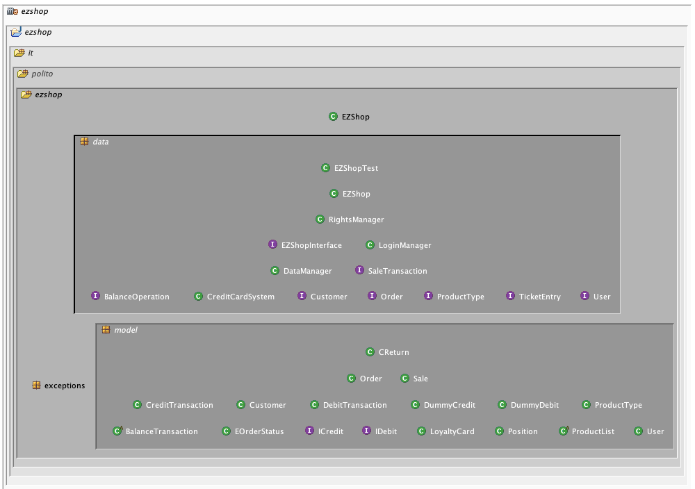
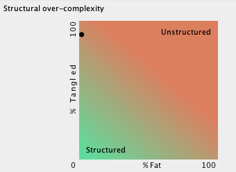

# Design assessment

# Levelized structure map

# Structural over complexity chart

# Size metrics

| Metric                                    | Measure |
| ----------------------------------------- | ------- |
| Packages                                  | 6       |
| Classes (outer)                           | 51      |
| Classes (all)                             | 53      |
| NI (number of bytecode instructions)      | 7811    |
| LOC (non comment non blank lines of code) | 3359    |

# Items with XS

| Item                           | Tangled | Fat  | Size | XS   |
| ------------------------------ | ------- | ---- | ---- | ---- |
| ezshop.ezshop.it.polito.ezshop | 15%     | 4    | 7811 | 1144 |

# Package level tangles

# Summary analysis
There are no big differences with respect to our original design document. There are just few differences caused by the interfaces provided to match the API. To remove some tangles it would be useful to move these interfaces in a different package.
