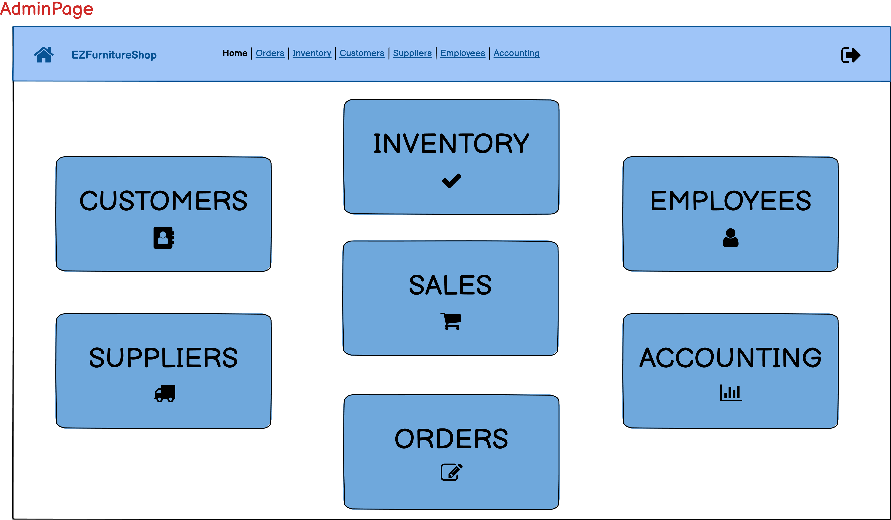
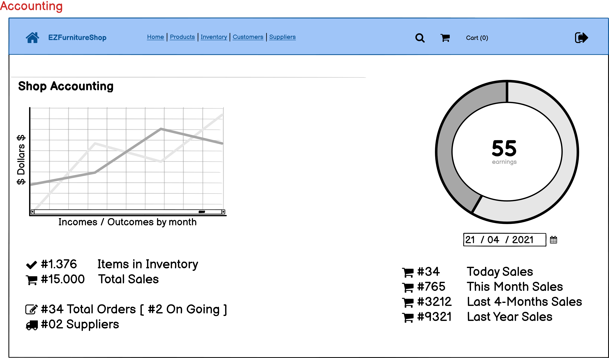
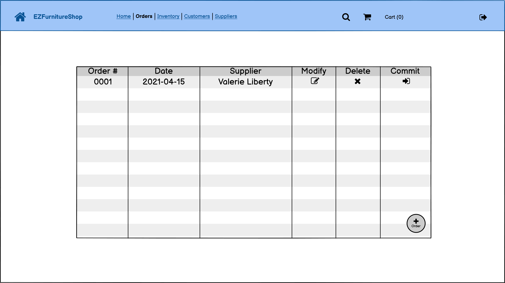

# Graphical User Interface Prototype  

Authors: Baldazzi Alessandro, D'Anzi Francesco, Galota Simone, La Greca Salvatore Gabriele

Date: 20/04/2021

Version: 1.0

## Login Page

## Logged User
| Employee View             |  Owner View |
:-------------------------:|:-------------------------:
|  |  |

## Accounting

## Employees List

## Use case 1, UC1 - Adding Employees
.png)

## Scenario 1.1 and 1.2
| Successful adding        |  Error with adding      |
:-------------------------:|:-------------------------:
| .png) | .png) |

## Use case 2, UC2 - Modifying Employees
.png)

## Scenario 2.1 and 2.2
| Successful modifying     |  Error with modifying      |
:-------------------------:|:-------------------------:
| .png) | .png) |

## Use case 3, UC3 - Deleting Employees
.png)

## Customers List
.png)

## Use case 4, UC4 - Adding Customers
.png)

## Scenario 4.1 and 4.2
| Successful adding        |  Error with adding      |
:-------------------------:|:-------------------------:
| .png) | .png) |

## Use case 5, UC5 - Modifying Customers
.png)

## Scenario 5.1 and 5.2
| Successful modifying     |  Error with modifying      |
:-------------------------:|:-------------------------:
| .png) | .png) |

## Use case 6, UC6 - Deleting Customers
.png)

## Use case 8, UC8 - Managing Sales 

| Today Sales             |  All Sales |
:-------------------------:|:-------------------------:
|  |  |

When the User clicks on "Sales" from the Home page, a list of previous sales is shown to give a fast look to them.

A big button "GO TO CART" is available to let the employee to start a new sale (or to restore a previous one if it was not committed).

## Scenario 8.1 (Creating a shopping cart)
.png)

Here the employee can fill the cart with all the items to sale (they can be inserted using a Barcode Reader or manually by clicking on **Search in Inventory** button). Is possible to change the quantity for each inserted item too. 

It's also possible to link the cart to a customer, by clicking on **Link to a Customer** button. The selected customer will be shown on the right side, in the **Summary** part of the page.

In the **Summary** it's possible to see the cart's subtotal, the computed VAT and the Total. 

A button **PAY** is available to commit the cart and let the customer pay in order to conclude the sale.

## Scenario 8.2 (Creating a shopping cart and inserts a quantity of an item not available in inventory)
.png)

In the case that a wrong quantity is inserted, an Error Box is showed, informing the employee that the desired quantity is not available.

## Use case 9, UC9 - Managing Sales (Committing shopping cart)

## Scenario 9.1 (Committing a shopping cart)
.png)

Here a frozen version of the Cart is shown (not possible to change quantity of an item, at most is possible to remove it). It's always possible to go back to the cart by pressing **Go back to the Cart** button.

On the right side, we always have our **Summary** with two buttons:

- Pay **With Cash**: lets the customer pay with cash through the internal Cash Register
- Pay **With POS**: activates the external POS and lets the customer pay with the supported payment type

| Payment with Cash            |  Payment with POS |
:-------------------------:|:-------------------------:
| -CASH.png) | -POS.png) |

## Scenario 9.2 - Scenario 9.3 - Scenario 9.4

| Problems with Printer            |  Problems with POS |
:-------------------------:|:-------------------------:
|  | .png) |

## Use case 10, UC10 - Managing Inventory (Register new item)

## Scenario 10.1 and 10.2

| Add successfully      |  Add with error |
:-------------------------:|:-------------------------:
|  |  |

## Use case 11, UC11 - Managing Inventory (Modify quantity/price of an existing item)
## Scenario 11.1
| Modify view     |  View after modify |
:-------------------------:|:-------------------------:
| |  |

## Use case 12, UC12 - Managing Inventory (Delete an item)
## Scenario 12.1
| Delete view     |  View after Delete |
:-------------------------:|:-------------------------:
| | |

## Use case 13, UC13 - Managing Inventory (Search an item)
## Scenario 13.1
| Search view     |  View after Search |
:-------------------------:|:-------------------------:
| | |

## Suppliers List
.png)

## Use case 14, UC14 - Adding Suppliers
.png)

## Scenario 14.1 and 14.2
| Successful adding        |  Error with adding      |
:-------------------------:|:-------------------------:
| .png) | .png) |

## Use case 15, UC15 - Modifying Suppliers
.png)

## Scenario 15.1 and 15.2
| Successful modifying     |  Error with modifying      |
:-------------------------:|:-------------------------:
| .png) | .png) |

## Use case 16, UC16 - Deleting Suppliers
.png)

## Use case 18, UC18 - Create an Order
## Scenario 18.1
| Orders list    |
:-------------------------:
| |

| Creating order |
:-------------------------:
| |

|  Order added |
:-------------------------:
| |

## Use case 19, UC19 - Modify an Order
## Scenario 19.1
| Orders list    |
:-------------------------:
| |

| Modifying order |
:-------------------------:
| |

|  Order modified |
:-------------------------:
| |

## Use case 20, UC20 - Delete an Order
## Scenario 20.1
| Orders list    |
:-------------------------:
| |

| Successful deletion |
:-------------------------:
| |

|  Order deleted |
:-------------------------:
| |

## Use case 21, UC21 - Commit an Order
## Scenario 21.1 and 21.2
| Orders list    |
:-------------------------:
| |

| Successful commit     |  Error with commit      |
:-------------------------:|:-------------------------:
|  |  |